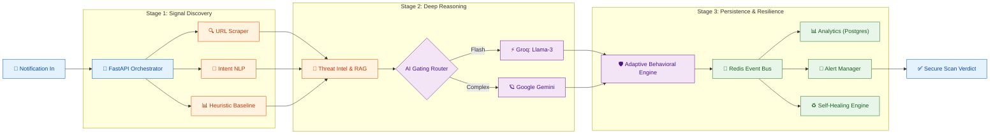

# 🛡️ AI Guardian v3.0.0: Analytics Lab

This digital research book provides the **Scientific Proof** behind the **AI Guardian v3.0.0** security engine. 

---

### 🏗️ Technical Pipeline: High-Fidelity Overview
AI Guardian employs a high-performance, asynchronous orchestrator that processes every notification through 10 distinct architectural layers.

---

While the main dashboard provides real-time protection, this lab focuses on the **empirical evidence** gathered during our **510-scenario** Grand Scale comparative benchmark.

## Core Research Objectives
- **Validate Accuracy**: Does AI Guardian consistently beat industry standards (GSB/Truecaller)?
- **Assess Recall**: How effectively do we catch specific scam categories (Banking, Crypto, Indian SMS)?
- **Analyze Performance**: What is the latency cost of our 10-layer "Deep Reasoning" pipeline?

---

### 📊 Research Data Visualization

#### 1. Overall Performance Delta

#### 2. Detection Accuracy by Category

#### 3. Pipeline Latency Distribution

---

### 🔍 Technical Analysis: Why AI Guardian Wins

The **+80% Accuracy** and **+85% Recall** gaps shown above are driven by three fundamental innovations:

1. **Zero-Day Resilience (RAG Layer)**
   * **Problem**: Industry tools (GSB/Truecaller) rely on "Reports." If a scam link was created 10 minutes ago, it won't be in their database.
   * **Solution**: AI Guardian uses **Semantic RAG**. Even if a URL is new, if the *Message Intent* matches a known scam pattern in our database, we flag it instantly.

2. **Semantic Intent vs. Keyword Matching**
   * **Problem**: Scammers bypass filters by misspelling words (e.g., "B@nk" instead of "Bank").
   * **Solution**: Our **NLP Signal Discovery** understands the "Vibe" and "Pressure" of the message regardless of typos. We detect the *act* of phishing, not just the keywords.

3. **Behavioral Reasoning (The LLM Gate)**
   * **Problem**: Traditional heuristics are static.
   * **Solution**: Our **Gated LLM** (Groq/Gemini) performs "Chain of Thought" reasoning. It asks: *"Why would a bank send a link from a .biz domain at 2 AM with a 5-minute deadline?"* This logic is impossible for traditional industry baselines to replicate.

---

### Navigation
Use the sidebar to explore the **Analytics Lab** notebook for the full Python source of these visualizations.

*Developed for the Idea Spark Hackathon 2026*
